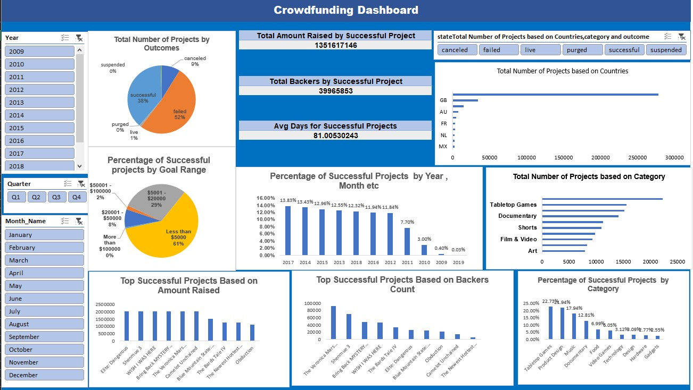
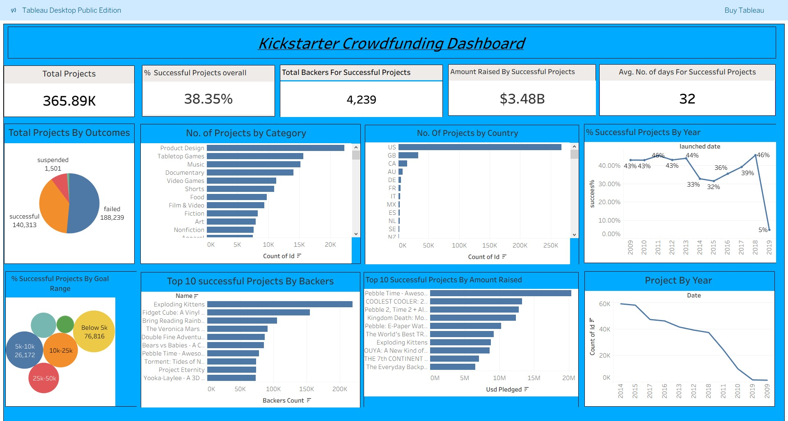

# Crowdfunding Data Analysis

## Objective
To analyze crowdfunding campaign data and identify factors that influence campaign success.

## Tools Used
- Microsoft Excel
- Power BI
- Tableau

## Dataset
Public crowdfunding dataset containing campaign category, goal amount, pledged amount, country, and campaign status.

## Analysis Performed
- Campaign success rate analysis
- Goal vs pledged amount comparison
- Category-wise performance
- Country-wise trends

## Key Insights
- Campaigns with lower funding goals had higher success rates
- Technology and creative categories showed better performance
- Certain countries had higher average pledged amounts

## Dashboard
### Excel Dashboard

### Power BI Dashboard

### Tableau Dashboard

## Conclusion
This project demonstrates how data analysis can support better business decisions.# Crowdfunding-Data-Analysis
Business analysis of crowdfunding campaigns using Excel, Power BI and Tableau
